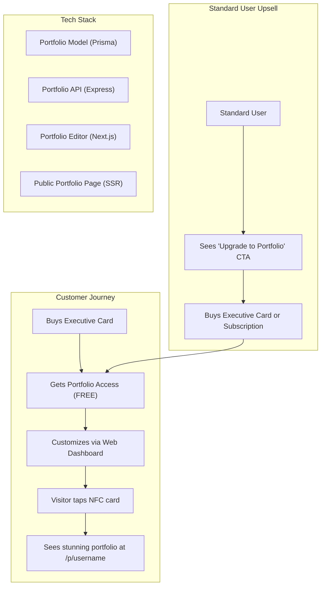

# 🚀 TAGIT Premium Portfolio — "Executive Presence" Feature

> **One-line pitch:** When someone taps a TAGIT Executive card, they don't just see a business card — they land on a **stunning, fully customizable personal portfolio website** that the card owner designs themselves from the mobile app or web dashboard.

---

## Background & Real-World Problem Analysis

### The Problem Today
When someone taps an NFC business card, they see a **generic contact card** — name, title, links. It looks the same as everyone else's. No personality, no "wow factor", no reason to remember the person.

**Real-world competitors (Linktree, Popl, HiHello, Blinq)** all suffer from the same issue: they give you a link-in-bio page, not a *personal brand experience*. None of them offer a **full portfolio page** as a premium differentiator.

### The TAGIT Solution
Premium (Executive) card buyers get a **free personal portfolio page** — a mini-website that acts like their digital headquarters. It's not just a card anymore; it's a **first impression engine**.

### Why This Wins

| Stakeholder | Pain Point | Our Solution |
|---|---|---|
| **Customer (Card Buyer)** | "My NFC card looks the same as everyone's" | Full portfolio with projects, testimonials, gallery — completely unique |
| **Customer** | "I can't update my portfolio easily" | Real-time editor from mobile app or web — no coding needed |
| **Customer** | "I need a personal website but can't code" | Portfolio IS their website — instant personal brand |
| **Seller (TAGIT)** | "Hard to justify premium pricing" | Portfolio = massive value-add that costs us nothing to deliver |
| **Seller** | "Low customer retention" | Customers keep coming back to edit their portfolio = engagement |
| **Seller** | "Need upsell opportunities" | Free with Executive card, paid standalone for Standard users → upsell path |
| **Visitor (Tap Recipient)** | "I forgot who this person was" | Memorable portfolio experience makes lasting impression |

---

## Architecture Overview



---

## Proposed Changes

### Component 1: Database Schema (Prisma)

#### [MODIFY] [schema.prisma](file:///c:/Users/sheha/Desktop/NFC Project/packages/backend/prisma/schema.prisma)

Add new models for the portfolio system. The key design decision is a **section-based architecture** — each portfolio is composed of ordered, typed sections that the customer can add/remove/reorder.

**New Enums:**
```prisma
enum PortfolioTheme {
  MIDNIGHT_LUXE     // Dark glassmorphism (matches NFC card vibe)
  ARCTIC_FROST      // Light premium with frosted glass
  SUNSET_EMBER      // Warm dark with amber/rose gradients
  OCEAN_DEPTH       // Deep navy with cyan accents
  MONOCHROME_ELITE  // Black & white professional
}

enum PortfolioSectionType {
  HERO              // Full-width hero with name, title, CTA
  ABOUT             // Rich text about section
  EXPERIENCE        // Work experience timeline
  PROJECTS          // Project showcase grid/carousel
  SKILLS            // Skill bars/chips with proficiency
  TESTIMONIALS      // Client/colleague quotes carousel
  GALLERY           // Image gallery (masonry or grid)
  CONTACT           // Contact form + social links
  STATS             // Animated statistics counters
  CUSTOM_HTML       // Custom rich text block (Premium+)
}
```

**New Models:**

```prisma
model Portfolio {
  id              String          @id @default(cuid())
  isPublished     Boolean         @default(false)
  theme           PortfolioTheme  @default(MIDNIGHT_LUXE)

  // Customizable brand colors (override theme defaults)
  primaryColor    String          @default("#6451fa")
  accentColor     String          @default("#22d3ee")
  
  // Hero section data (always present)
  headline        String?         // e.g. "Full-Stack Developer & Designer"
  subheadline     String?         // e.g. "Building digital experiences that matter"
  ctaText         String?         @default("Get in Touch")
  ctaUrl          String?
  heroImageUrl    String?         // Background/cover image
  
  // SEO
  metaTitle       String?
  metaDescription String?
  
  // Analytics
  viewCount       Int             @default(0)
  
  // Ownership — 1:1 with Profile
  profileId       String          @unique
  profile         Profile         @relation(fields: [profileId], references: [id], onDelete: Cascade)
  
  // Sections — ordered building blocks
  sections        PortfolioSection[]
  
  createdAt       DateTime        @default(now())
  updatedAt       DateTime        @updatedAt
  
  @@map("portfolios")
}

model PortfolioSection {
  id          String                @id @default(cuid())
  type        PortfolioSectionType
  title       String?               // Section heading (optional)
  sortOrder   Int                   @default(0)
  isVisible   Boolean               @default(true)
  content     Json                  // Flexible JSON content per section type
  
  // Ownership
  portfolioId String
  portfolio   Portfolio              @relation(fields: [portfolioId], references: [id], onDelete: Cascade)
  
  createdAt   DateTime              @default(now())
  updatedAt   DateTime              @updatedAt
  
  @@map("portfolio_sections")
}
```

**Section `content` JSON Schemas by Type:**

| Section Type | Content JSON Shape |
|---|---|
| `ABOUT` | `{ text: string, imageUrl?: string }` |
| `EXPERIENCE` | `{ items: [{ company, role, period, description, logoUrl? }] }` |
| `PROJECTS` | `{ items: [{ title, description, imageUrl, liveUrl?, githubUrl?, tags[] }] }` |
| `SKILLS` | `{ items: [{ name, proficiency: 0-100, category? }] }` |
| `TESTIMONIALS` | `{ items: [{ quote, author, role, company, avatarUrl? }] }` |
| `GALLERY` | `{ images: [{ url, caption?, alt? }], layout: "grid" \| "masonry" }` |
| `CONTACT` | `{ showEmail, showPhone, showForm, formWebhook? }` |
| `STATS` | `{ items: [{ value, label, suffix? }] }` e.g. `{ value: 50, label: "Projects", suffix: "+" }` |
| `CUSTOM_HTML` | `{ html: string }` |

> [!IMPORTANT]
> The `Profile` model needs a new relation field `portfolio Portfolio?` added.

---

### Component 2: Backend API

#### [NEW] [portfolioRoutes.ts](file:///c:/Users/sheha/Desktop/NFC Project/packages/backend/src/routes/portfolioRoutes.ts)

New route file with these endpoints:

| Method | Route | Auth | Description |
|---|---|---|---|
| `GET` | `/portfolio/:username` | Public | Fetch published portfolio (SSR) |
| `GET` | `/portfolio/me` | Protected | Fetch own portfolio (editor) |
| `POST` | `/portfolio` | Protected + Premium | Create portfolio (first time) |
| `PATCH` | `/portfolio` | Protected | Update portfolio settings (theme, colors, hero) |
| `POST` | `/portfolio/sections` | Protected | Add a new section |
| `PATCH` | `/portfolio/sections/:sectionId` | Protected | Update section content |
| `DELETE` | `/portfolio/sections/:sectionId` | Protected | Remove a section |
| `PATCH` | `/portfolio/sections/reorder` | Protected | Bulk reorder sections |
| `PATCH` | `/portfolio/publish` | Protected | Toggle publish/unpublish |
| `POST` | `/portfolio/upload` | Protected | Upload portfolio images (gallery, projects, hero) |

#### [NEW] [portfolioController.ts](file:///c:/Users/sheha/Desktop/NFC Project/packages/backend/src/controllers/portfolioController.ts)

Key controller logic:

- **`createPortfolio`**: Checks `user.subscriptionTier === 'PREMIUM' || 'CORPORATE'` before allowing creation. Creates portfolio with default HERO and CONTACT sections pre-populated from profile data.
- **`getPublicPortfolio`**: Fetches published portfolio with all visible sections, increments `viewCount`. Returns 404 if not published.
- **`updatePortfolio`**: Validates theme enum, color hex codes. Only allows owner.
- **`addSection`**: Validates section type and content JSON against the expected schema for that type using Zod discriminated unions.
- **`reorderSections`**: Accepts `{ sectionIds: string[] }` and bulk-updates `sortOrder`.

#### [NEW] [premiumGuard.ts](file:///c:/Users/sheha/Desktop/NFC Project/packages/backend/src/middlewares/premiumGuard.ts)

Middleware that checks `req.user.subscriptionTier` is `PREMIUM` or `CORPORATE`. Returns 403 with upgrade messaging for `FREE` users.

#### [MODIFY] [index.ts](file:///c:/Users/sheha/Desktop/NFC Project/packages/backend/src/routes/index.ts)

Mount the new portfolio router: `apiRouter.use('/portfolio', portfolioRouter);`

---

### Component 3: Public Portfolio Page (Frontend — Visitor Experience)

This is the **"wow factor"** page. When someone taps an Executive NFC card, they land here.

#### [MODIFY] [page.tsx](file:///c:/Users/sheha/Desktop/NFC Project/packages/web/app/p/[username]/page.tsx)

Update the existing profile page to:
1. Check if the user has a published portfolio
2. If yes → render the full portfolio experience
3. If no → render the existing `ProfileCard` (backward compatible)

#### [NEW] `/app/p/[username]/PortfolioView.tsx`

A massive, premium client component that renders the full portfolio. Key sections:

1. **Hero Section** — Full-viewport parallax header with animated text reveal, profile photo with holographic ring effect, headline with typewriter animation, CTA button with magnetic cursor effect
2. **About Section** — Split layout with image + rich text, fade-in on scroll
3. **Experience Timeline** — Vertical animated timeline with company logos, staggered entrance
4. **Projects Grid** — Masonry/Bento grid with hover 3D tilt effect, live preview links
5. **Skills Section** — Animated progress bars that fill on scroll, categorized chips
6. **Testimonials Carousel** — Auto-playing carousel with quote marks, glassmorphism cards
7. **Gallery** — Lightbox gallery with masonry layout
8. **Stats Counter** — Animated number counters that tick up when in viewport
9. **Contact Section** — Gradient CTA with contact form, social links grid

**Design Themes:**

| Theme | Visual Style |
|---|---|
| `MIDNIGHT_LUXE` | Deep space dark with purple/cyan gradients, glass morphism, particle effects |
| `ARCTIC_FROST` | Clean white/light with frosted glass cards, subtle blue accents |
| `SUNSET_EMBER` | Dark base with warm amber→rose gradient accents, golden highlights |
| `OCEAN_DEPTH` | Deep navy with teal/cyan glow effects, wave animations |
| `MONOCHROME_ELITE` | Pure black/white with sharp typography, minimal but powerful |

#### [NEW] `/app/p/[username]/portfolio.css`

Theme-specific CSS variables and animations for the portfolio view. Each theme defines:
- `--portfolio-bg`, `--portfolio-surface`, `--portfolio-text`, `--portfolio-accent`
- Unique ambient effects (particles, waves, gradients)

---

### Component 4: Portfolio Editor (Customer Dashboard)

This is where premium customers build and customize their portfolio.

#### [NEW] `/app/portfolio/page.tsx`

The portfolio editor page. Protected route (must be logged in + premium tier).

#### [NEW] `/app/portfolio/PortfolioEditor.tsx`

The main editor component with:

1. **Split-screen Layout** — Left: editor panel, Right: live preview
2. **Theme Selector** — Visual theme cards the customer clicks to switch themes instantly
3. **Color Picker** — Custom primary/accent color overrides
4. **Section Manager** — Drag-and-drop section list with:
   - Add Section dropdown (shows all available section types)
   - Reorder via drag handles
   - Toggle visibility per section
   - Delete sections
   - Click to expand and edit section content
5. **Section Editors** — Type-specific form UI for each section:
   - **Experience Editor**: Add/remove timeline entries with fields for company, role, dates, description
   - **Projects Editor**: Card-based editor with image upload, title, description, links, tags
   - **Skills Editor**: Add skills with name + proficiency slider
   - **Testimonials Editor**: Quote, author, company fields
   - **Gallery Editor**: Drag-and-drop image upload with captions
   - **Stats Editor**: Number + label pairs
6. **Publish Toggle** — Big CTA to publish/unpublish with confirmation
7. **Preview Link** — Shareable URL to the live portfolio

#### [NEW] `/app/portfolio/editors/` (directory)

Individual editor components per section type:
- `ExperienceEditor.tsx`
- `ProjectsEditor.tsx`  
- `SkillsEditor.tsx`
- `TestimonialsEditor.tsx`
- `GalleryEditor.tsx`
- `StatsEditor.tsx`
- `AboutEditor.tsx`
- `ContactEditor.tsx`
- `HeroEditor.tsx`

---

### Component 5: API Client Updates

#### [MODIFY] [api.ts](file:///c:/Users/sheha/Desktop/NFC Project/packages/web/services/api.ts)

Add portfolio API methods:
```typescript
// Portfolio CRUD
export async function getMyPortfolio() { ... }
export async function createPortfolio() { ... }
export async function updatePortfolio(data: PortfolioUpdateData) { ... }
export async function togglePortfolioPublish() { ... }

// Section CRUD
export async function addPortfolioSection(data: SectionCreateData) { ... }
export async function updatePortfolioSection(sectionId: string, data: SectionUpdateData) { ... }
export async function deletePortfolioSection(sectionId: string) { ... }
export async function reorderPortfolioSections(sectionIds: string[]) { ... }

// Portfolio image upload
export async function uploadPortfolioImage(file: File) { ... }
```

---

### Component 6: Navigation & Access Control

#### [MODIFY] [layout.tsx](file:///c:/Users/sheha/Desktop/NFC Project/packages/web/app/(marketing)/layout.tsx)

Add "Portfolio" link in the navigation for logged-in premium users.

#### [MODIFY] Pricing page — add Portfolio as a premium feature highlight

Update the pricing page to prominently feature the portfolio:
- **Standard Plan**: ❌ "Personal Portfolio Website"
- **Pro Plan**: ✅ "Personal Portfolio Website (worth LKR 15,000+/yr)" 

---

## User Flows

### Flow 1: Premium Customer Creates Portfolio
```
1. Customer buys Executive card → subscription upgraded to PREMIUM
2. Customer logs in → sees "Create Your Portfolio" CTA in dashboard
3. Clicks CTA → POST /api/v1/portfolio (creates with default sections)
4. Lands on Portfolio Editor with pre-filled data from their profile
5. Customizes theme, adds projects, skills, testimonials
6. Hits "Publish" → portfolio goes live at tagit.com/p/username
7. Shares NFC card → visitors see the full portfolio
```

### Flow 2: Visitor Taps NFC Card
```
1. Visitor taps Executive NFC card
2. Browser opens tagit.com/p/username
3. Server checks: does this user have a published portfolio?
   → YES: Render full portfolio with selected theme
   → NO: Render existing ProfileCard (backward compatible)
4. Visitor is impressed, saves contact, explores portfolio
```

### Flow 3: Standard User Upsell
```
1. Standard user logs in → sees "Portfolio" in nav (locked icon)
2. Clicks → sees beautiful preview of what portfolio could look like
3. CTA: "Unlock with Executive Card" or "Subscribe to Pro"
4. Converts → gets portfolio access
```

---

## Open Questions

> [!IMPORTANT]
> **Q1: Image Hosting Strategy**  
> Portfolio images (projects, gallery, hero backgrounds) could generate significant storage. Should we:
> - A) Use Supabase Storage (already integrated) — simplest
> - B) Use a CDN like Cloudinary for automatic optimization + transforms
> - C) Keep using local `uploads/` directory (dev only, not scalable)
> 
> **Recommendation:** Start with Supabase Storage, it's already in your stack.

> [!IMPORTANT]
> **Q2: Portfolio URL Strategy**  
> Should the portfolio be at:
> - A) `/p/username` (same URL, auto-detects portfolio vs card) — seamless
> - B) `/portfolio/username` (separate URL) — explicit but two URLs to manage
> 
> **Recommendation:** Option A — `/p/username` auto-upgrades to portfolio when published. One URL = simpler for NFC chip programming.

> [!IMPORTANT]
> **Q3: Subscription Enforcement**  
> If a PREMIUM user downgrades to FREE:
> - A) Hide/unpublish the portfolio but keep data (can re-publish on upgrade)
> - B) Delete portfolio data after 30-day grace period
> 
> **Recommendation:** Option A — never delete customer data, just unpublish.

> [!IMPORTANT]
> **Q4: Contact Form**  
> The portfolio CONTACT section can optionally include a contact form. Where should form submissions go?
> - A) Email the portfolio owner directly
> - B) Store in a `PortfolioMessage` model and show in dashboard
> - C) Both — email notification + in-app inbox
> 
> **Recommendation:** Option B for MVP, add email notifications later.

---

## Verification Plan

### Automated Tests
```bash
# Run Prisma migration
npx prisma db push --accept-data-loss

# TypeScript type checking
npm run typecheck --workspace=packages/backend
npm run typecheck --workspace=packages/web

# Build verification
npm run build:backend
npm run build:web
```

### Manual Verification
1. Create a test user with PREMIUM subscription tier
2. Hit `POST /api/v1/portfolio` → verify portfolio created with default sections
3. Edit portfolio via the editor → verify live preview updates
4. Publish portfolio → visit `/p/username` → verify full portfolio renders
5. Test all 5 themes by switching in editor
6. Test section CRUD (add, edit, reorder, delete)
7. Test with FREE user → verify 403 on portfolio creation
8. Test backward compatibility → standard user with no portfolio still sees ProfileCard
9. Mobile responsive check — portfolio must look premium on phones

---

## Implementation Order

| Phase | What | Est. Files |
|---|---|---|
| **Phase 1** | Database schema + migration | 1 file |
| **Phase 2** | Backend API (routes, controller, middleware) | 4 files |
| **Phase 3** | API client methods | 1 file (modify) |
| **Phase 4** | Public Portfolio View (the "wow" page) | 3 files |
| **Phase 5** | Portfolio Editor + Section Editors | 12 files |
| **Phase 6** | Navigation, access control, pricing update | 3 files (modify) |

**Total: ~24 files** (14 new + 10 modified)
